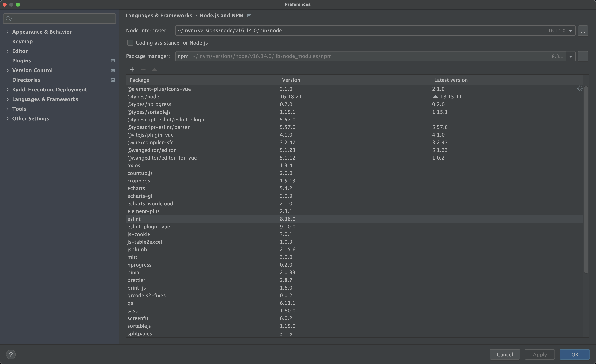

# stark-vue-next-admin 
forked from https://github.com/lyt-Top/vue-next-admin , 基于vue3.x 、Typescript、vite、Element plus等，适配手机、平板、pc 的后台开源免费模板库

# 代码仓库  
https://github.com/StarksJohn/stark-vue-next-admin

# 开发指南 
https://lyt-top.gitee.io/vue-next-admin-doc-preview/home/introduce/

# 项目node版本号:

# 分支说明
https://lyt-top.gitee.io/vue-next-admin-doc-preview/home/install/#%E4%BB%93%E5%BA%93%E4%BB%A3%E7%A0%81%E5%90%84%E5%88%86%E6%94%AF%E8%AF%B4%E6%98%8E-%E5%90%8E%E7%BB%AD%E5%B0%86%E6%B7%BB%E5%8A%A0%E6%9B%B4%E5%A4%9A%E5%88%86%E6%94%AF
1. master (基于 vue3.x、vite、ts、Element plus等，主项目模板)
2. VUE3_TS:因此项目部署在 https://code.cxaone.cn/stark.zhang/boheAuth 项目,故 此分支用于在 boheAuth 项目里 测试部署代码, 在 https://github.com/StarksJohn/stark-vue-next-admin 项目里没有此分支,每次 测试部署,都把 stark-vue-next-admin 项目的代码 拷贝到  boheAuth 项目里的 VUE3_TS 分支, .git 文件 不要 拷贝

# 怎么更新主项目的master分支代码到此项目的master
https://chat.openai.com/share/f38a1565-fe0d-4910-960d-bf49af086f24
1. git remote add vue-next-admin-master https://github.com/lyt-Top/vue-next-admin.git
2. git fetch vue-next-admin-master
3. git checkout master
4. git merge vue-next-admin-master/master

# 项目搭建
1. npm install
2. 配置 vite 
https://lyt-top.gitee.io/vue-next-admin-doc-preview/home/fast/#%E9%85%8D%E7%BD%AE-vite
3. 安装 typescript
https://lyt-top.gitee.io/vue-next-admin-doc-preview/home/fast/#%E5%AE%89%E8%A3%85-typescript
4. 安装 element-plus
https://lyt-top.gitee.io/vue-next-admin-doc-preview/home/fast/#%E5%AE%89%E8%A3%85-element-plus
5. 配置目录别名 @
https://lyt-top.gitee.io/vue-next-admin-doc-preview/home/fast/#_2-%E9%85%8D%E7%BD%AE%E7%9B%AE%E5%BD%95%E5%88%AB%E5%90%8D-%E6%96%B9%E4%BE%BF%E5%BC%95%E7%94%A8
6. 安装 vue-router-next 
https://lyt-top.gitee.io/vue-next-admin-doc-preview/home/fast/#%E5%AE%89%E8%A3%85-vue-router-next
7. 配置eslint
https://lyt-top.gitee.io/vue-next-admin-doc-preview/home/eslint/#eslint
    坑: 由于  this.options.parse is not a function  这个报错 暂时无法解决, 故暂停用 eslint

# UAT
   1. debug: 当前电脑 node -v  版本改成 16.14, nvm alias default v16.14.0
      npm run dev:uat     (use env.debug_uat file) ,浏览器访问 http://localhost:8888/
   2. release :
     本地打包+预览: (成功)
         https://lyt-top.gitee.io/vue-next-admin-doc-preview/config/build/#%E9%A2%84%E8%A7%88
         1. 根目录 .env.release_uat 文件中的 VITE_PUBLIC_PATH 置空
         2. npm install -g http-server
         3. 在 package.json 中添加脚本 "serve": "http-server ./dist"
         4. 本地打包 npm run build:uat  (use env.release_uat file)
         5. 项目根目录运行  npm run serve
   3. jenkins :在 boheAuth 项目的 VUE3_TS 分支: 
      1. 改 .env.release_uat 文件的 VITE_PUBLIC_PATH 为 "https://uat-boheauth.cxaone.cn/"
      2. 打包: 在 https://jen.cxaone.cn/view/%E6%89%93%E5%8C%85%E5%B7%A5%E5%85%B7/job/FrontBuildDockerImage/build?delay=0sec 打包  
         1. project : boheauth
         2. branch : VUE3_TS
         3. docker_image_tag: VUE3_TS_xxxx   (不要带:  或者  + ) 不勾选 MergeMaster
         4. NodeVersion : V16.14.0
         5. INSTALL_COMMAND_ACTIVE : npm install --unsafe-perm=true --allow-root
         6. BUILD_COMMAND_ACTIVE : npm run build:uat
            1. 坑: 
                1. permission denied, open '/home/jenkins/agent/workspace/package_image/node_modules/vue-demi/lib/index
                                解: http://www.manongjc.com/detail/64-rwkgrgylhzhtfyo.html 
                                INSTALL_COMMAND_ACTIVE 使用 npm install --unsafe-perm=true --allow-root
                2. failed to load config from /home/jenkins/agent/workspace/package_image/vite.config.ts
                                解: 项目node版本 升级到 v16.14.0 
                3. invalid argument " " for "-t, --tag" flag: invalid reference format
                                解: 分支名不能带 +  号,  改成 VUE3_TS
                4. 打包流程很慢, 主要是 编译代码 阶段 慢, 大概 半小时 ,如 
                   1. 解: 和刘广沟通后,发现是 设置npm缓存卡住了，他把这个步骤去掉了就好了
      3. 部署: 在 https://jen.cxaone.cn/view/deploy/job/Deploy-hw-all/ 里
                       PushType: image
                       keywords_active: 打包出来的完整镜像
                       Deploy: yes
                       DeployEnv: uat
      4. 访问 https://uat-boheauth.cxaone.cn/
            

# 坑:
1.  git push origin master 时报错: fatal: unable to access 'https://github.com/StarksJohn/stark-vue-next-admin.git/': LibreSSL SSL_connect: SSL_ERROR_SYSCALL in connection to github.com:443 
    1. 关  surfshark 
    
